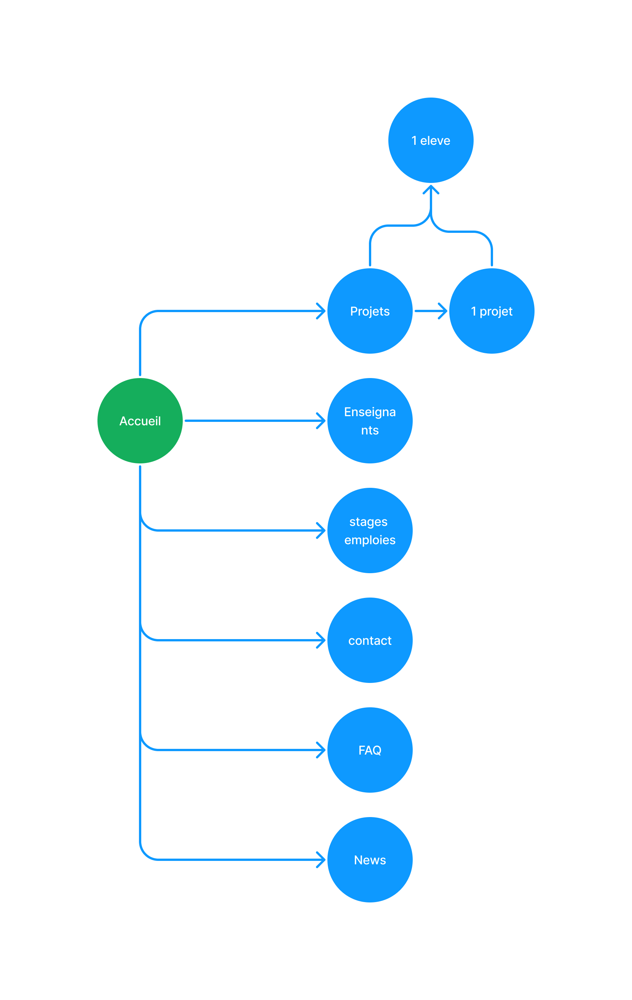

# Cahier des charges

## **Présentation de l’entreprise**

La Haute École de la Province de Liège est présente sur pas moins de 11 implentations répartis sur Liège et sa Province. Elle propose 70 formations dans 12 domaines : 41 Bacheliers, 16 Masters et 13 Spécialisations. Forte de 1200 encadrants, elle offre à plus de 10 000 étudiantes et étudiants une formation combinant aspects théoriques et expériences pratiques, grâce à des stages en milieu professionnel et de nombreuses rencontres avec des représentants des secteurs socio-économiques. Le projet est pour le bachelier en techniques graphique option web.

Le role du projects est d’augmenter le nombre d’etudiants dans ce bachelier en montrant des travaux d’étudiants et en mettant certains services de communication en place.

## **Les objectifs du site**

Il s’agit essentiellement d’un site vitrine pour présenter et illustrer le bachelier techniques graphique section web. Il permettra aussi de poser des questions et d’y répondre sous forme de blog. Il doit regrouper toutes l’activités de la section web de la HEPL et la representer au mieux en y

## **La cible adressée par le site**

Les publiques cibles de ce site sont les particuliers mais aussi certaines entreprises. Il s’agit ici des futurs eleves, des parents des futurs eleves, des entreprises de developpement web qui on une offre de stage ou d’emploie a poster et des curieux des réseaux sociaux.

**Profile 1**

David vit à liege, aime passer du temps sur son ordinateur et en passe meme un peu trop. Il a toujours aimé les belles choses et cherche des études qui mélangent infomatique, creation et design. Il vient de finir la secondaire et apres avoir cisité le site de la HEPL cherche des avis sur cette formation. Il veut comparer les deux choix possible pour lui, c’est a dire Liege ou Namur. C’est a ce moment que le site doit ètre trouvé et ensuite convaincant pour david.

**Profile 2**

Patrick est un chef d’entreprise sur liege dans le monde du web, il fait du web depuis 10 ans et cherche un stagiaire pour la premiere fois cette année. Il cherche d’abord ou il peut trouver des etudiants en web puis Il cherce une personne de contact pour faire une demande(faire une offre de stage). C’est a ce moment qu’il doit tomber sur le site pour etre rassure sur la formation et plus particulièrement tomber sur le formulaire pour faire une offre de stage.

## **Périmètre du projet**

Le site doit ètre miltilingue. Il dois ètre en Francais, en néerlandais, en allemand et en anglais. Et il doit évidemment ètre adapté aux mobiles. 

## **Description de l’existant**

Il y a des informations à récupérer sur le site de la HEPL à propos de la section du bachelier. ([https://www.hepl.be/fr/techniques-infographiques/web](https://www.hepl.be/fr/techniques-infographiques/web))

L’aspect graphique du site est a créer(logo, choix de couleurs, typos,…).

Le chef de projet est Justin VINCENT

Monsieur VILAIN peut donner un avis et faire des retours sur l’avancement du projet.

## Charte graphique

L’aspect graphique du site est a créer(logo, choix des couleurs, typos,…).

Pour commencer un nom représentant la section web doit etre trouvé. Un logo doit en decouller. Le logo sera en accord avec les choix graphiques qui seront pris. c’est a dire les choix typographiques, de couleurs a utiliser, d’ambiances, …

## **Design**

Les Maquettes seront realisées sur adobe XD. Elles permettront d’avoir une idée de l’ambiance de la navigation, et de l’organisation du contenu.

## **Arborescence du site**

## **Description fonctionnelle :**

Un espace administrateur sera present sur le site pour la gestion de celui-ci. Il pourra par exemple ajouter les offres d’emploies reçues par mail, gerer les ajouts de projets et d’élèves.

Le site doit integrer une possible inscription à la newsletter de la section. Il intègrera aussi un forum pour la gestions de la FAQ.

## **Informations relatives aux contenus**

Sur ce site on retrouvera principalement une présentation des projets réalisés par les élèves de la section web.

On présentera aussi les cours present dans la section (presentation du parcours dans la section web), les profs, les élèves, les news qui concernent la section web (activités, conférences, date de la rentrée), une serie de questions avec réponses

Voir fichiers md sur les contenus

Accueil:
- navigation principale pour passer de page en page rapidement et facilement avec logo
- Un CTA avec illustration ou image avec phrase d’accroche
- Liste de quelques projets récents avec un lien vers la page des projets
  - illustration du projet
  - créateur(s) du projet
  - nom du projet
  - lien vers la page du projet
- Invitation a nous contacter
  - titre
  - invitation a la decouverte du formulaire de contact
  - lien vers la page de contact
- bas de page
  - Possibilité de s’inscrire a la news letter
  - liens de contact
  - Réseaux sociaux
  
Projets:
- navigation principale pour passer de page en page rapidement et facilement avec logo
- liste des projets (systeme de filtrage des projets en fonction d’une année scolaire ou d’un eleve)
  - illustration du projet
  - nom du projet
  - courte introduction au projet
  - createur(s) du projet
  - date de publication du projet
  - lien vers la page du projet
- bas de page
  - Possibilité de s’inscrire a la news letter
  - liens de contact
  - Réseaux sociaux

D’un projet:
- navigation principale pour passer de page en page rapidement et facilement avec logo
- nom du projets
  - description du projet
  - date de publication
  - createur(s)
    - nom
    - photo
  - lien vers le git du projet si il y en a un
  - lien vers l’url du site si il est toujours en ligne
- bas de page
  - Possibilité de s’inscrire a la news letter
  - liens de contact
  - Réseaux sociaux

Enseignants:
- navigation principale pour passer de page en page rapidement et facilement avec logo
- liste des enseignants
  - nom de l’enseignant
  - photo de l’enseignant
  - descrition du parcours de l’enseignant
  - cours donné par l’enseignant
- bas de page
  - Possibilité de s’inscrire a la news letter
  - liens de contact
  - Réseaux sociaux

D’un eleve:
- navigation principale pour passer de page en page rapidement et facilement avec logo
- Nom de l’eleve
  - photo de l’éleve
  - courte description de l’eleve
  - année d’inscription et de sortie de l’eleve
  - lien vers le portfolio de l’eleve
  - adresse mail perso de l’eleve
  - liste des projets de l’eleve
- bas de page
  - Possibilité de s’inscrire a la news letter
  - liens de contact
  - Réseaux sociaux

Ce site contiendra des articles avec du texte, des images, des fichiers téléchargeables, des vidéos de présentation, des liens.

## **Contraintes techniques :**

Ce site sera développé avec Laravel et doit impérativement ètre compatible avec tout les navigateurs.

## **Planning**

- Cahier des charges pour le 26 sept.
- Design dans XD pour le 17 octobre.
- Livraison du site finale pour la session d’examen de janvier.